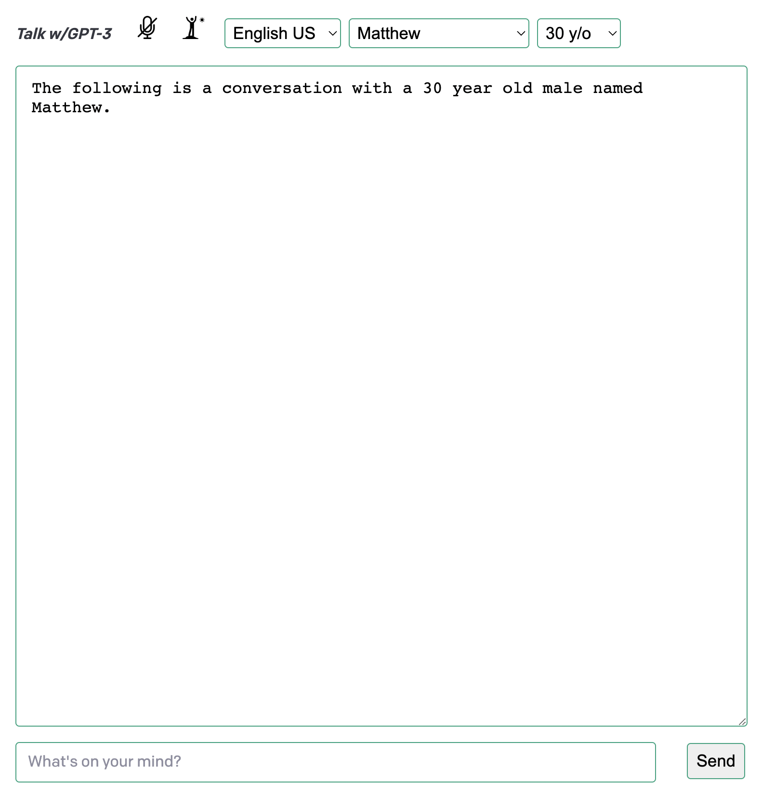
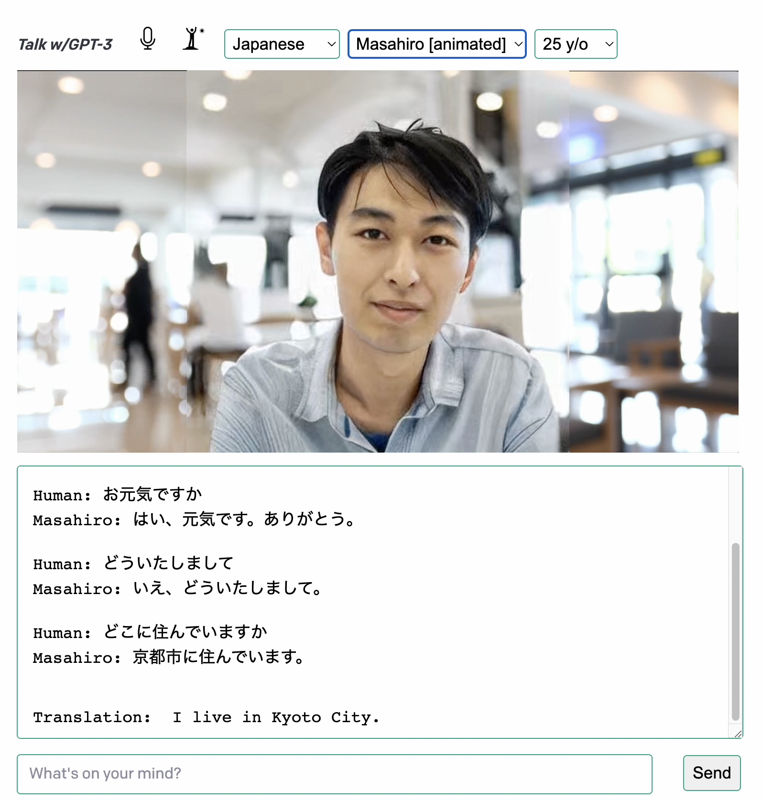

# Talk w/GPT-3 app: Getting started

The **Talk w/GPT-3** application was developed by [James L. Weaver](https://github.com/JavaFXpert)  (the author of this document) to get more new language speaking and listening practice. This application is open source, Apache 2.0 licensed, and leverages the following technologies:

- **Application framework:** [Next.js](https://nextjs.org/) with [React](https://reactjs.org/)
- **Large language model:** GPT-3 from [OpenAI](https://openai.com/) 
- **Voice speech to text:** [react-speech-recognition](https://www.npmjs.com/package/react-speech-recognition) React library. This library requires using a Chrome browser, or using a polyfill.
- **Voice text to speech:** [Amazon Polly](https://aws.amazon.com/polly/)
- **Web search:** [SerpApi](https://serpapi.com/)
- **Animated speaking avatars:** [Ex-Human](https://exh.ai/) Talking Heads

This is a "bring your own keys" application, so you'll need keys for OpenAI, Amazon Polly, SerpApi and optionally Ex-Human. 

Here's a three-minute [video that demonstrates some of the application's functionality](https://youtu.be/QXnWlAQq8tY).

Follow the instructions below to try the **Talk w/GPT-3** application out for yourself. 

## Setup

1. If you don’t have Node.js installed, [install it from here](https://nodejs.org/en/)

2. Clone this repository

3. Navigate into the project directory

   ```bash
   $ cd talk-with-gpt3
   ```

4. Install the requirements

   ```bash
   $ npm install
   ```

5. Make a copy of the example environment variables file

   ```bash
   $ cp .env.example .env
   ```

6. Add your OpenAI [API key](https://beta.openai.com/account/api-keys) and SerpApi [key](https://serpapi.com/manage-api-key) to the newly created `.env` file

7. Add your [Amazon Polly](https://aws.amazon.com/polly/) keys, and optionally your [Ex-Human](https://exh.ai/) token, to the app. This will require editing the following file:

    `pages/index.js` 

   Either supply the keys/token directly where indicated, or use environment variables.

8. Create an optimized production build of the app

   ```bash
   $ npm run build
   ```

9. Start the application as a local server

   ```bash
   $ npm start
   ```

10. Access the app at [http://localhost:3000](http://localhost:3000) from a Chrome browser.

The app should appear as shown in the following image:



As the image indicates, you'll initially be speaking English with a 30 year old male AI character named Matthew.

## Using the Talk w/GPT-3 app

### Toggling the microphone on/off

The microphone is off when the app first appears, so click the muted microphone icon to toggle it on. In addition to the microphone icon changing appearance, the current AI character's voice should announce that the microphone is on. To turn it back off, click the microphone icon again.

Note: If the application appears frozen, turning the microphone off and on usually rectifies the issue.

### Toggling the AI character's awake/asleep state

When the microphone is on, the voice speech to text facility processes what is heard, but the resultant text is only sent to GPT-3 when the AI character is awake. Consequently, the AI character only responds when awake. To make the AI character go to sleep, either click the **awake/asleep** icon, or say "go to sleep", "ve a dormir", "va te coucher", or "寝て", in English, Spanish, French or Japanese, respectively. To make the AI character wake up, either click the **awake/asleep** icon, or say "wake up", "despierta", "réveillez-vous", or "起きて", in English, Spanish, French or Japanese, respectively.

**Note:** The author is only proficient at speaking English, so please do create a GitHub issue that points out more natural ways to say any of the non-English phrases in this document.

### Selecting a practice language

To select a language other than English to practice, either choose it from the leftmost dropdown, or say "let's switch to X" where X is your desired language. Languages supported currently include English, Spanish, French and Japanese. To switch back to English, either use the dropdown or say "cambiemos a inglés", "passons à l'anglais", or "英語に切り替えましょう", in Spanish, French or Japanese, respectively.

### Selecting an AI character

There are multiple AI characters available for each language, with various genders and default ages. To choose an AI character, use the middle dropdown. Some AI characters (**Hiroto** and **Masahiro**) have animated avatars, as noted by **[animated]** after the AI character's name. You'll need to acquire and setup an [Ex-Human](https://exh.ai/) token in order to use these AI characters. The following image shows the Masahiro animated avatar having a conversation with a user.



### Changing an AI character's age

The age of an AI character is by default included in the GPT-3 prompt, and often affects their responses. To temporarily change an AI character's age, select an age from the rightmost dropdown. This may be leveraged, for example, by a language learner to attempt to constrain the AI character's responses to more commonly used words.

### Conversing with an AI character

To converse with an AI character, speak using the selected language.  Alternatively, type into the text box at the bottom of the app and either press the **enter** key or click the **Send** button. As shown in the previous image, the scrollable text area in the center of the app displays the initial GPT-3 prompt as well as the conversation so far. Each time you take a turn, the contents of the text area plus what you just said is sent as the next prompt to GPT-3.

#### Repeating the AI character's most recent utterance

To ask the AI character to repeat their most recent utterance, say "repeat", "repetir", "répéter" or "もう一度", in English, Spanish, French or Japanese, respectively.

#### Translating the AI character's most recent utterance to English

To ask the AI character to translate their most recent utterance to English, say "translate", "traduce", "traduire" or "翻訳して", in English, Spanish, French or Japanese, respectively.

#### Erasing a conversation

A conversation is automatically erased from the app when changing languages, AI characters, or ages. To erase a conversation in place, say "erase the conversation", "borrar la conversación", "effacer la conversation" or "会話を消去して", in English, Spanish, French or Japanese, respectively.

### Inquiring about dates and times in various locations

To accommodate inquiries about times and dates in various locations, some phrases are processed programmatically rather than by GPT-3.

#### Inquiring about the current time

Questions such as "What time is it?", "¿Qué hora es?", "Quelle heure est-il?" or "今何時ですか" may be used to inquire about the current time, in English, Spanish, French or Japanese, respectively. Here's an example:

`Human: what time is it`
`Matthew: It is 10:14 AM.`

#### Inquiring about the current time in a particular location

Questions such as "What time is it in Tokyo?", "¿Qué hora es en tokio?", "Quelle heure est-il à tokyo?" or "東京は今何時ですか" may be used to inquire about the current time in Tokyo, in English, Spanish, French or Japanese, respectively. Here's an example:

`Human: Qué hora es en Tokio`
`Conchita: 11:21 p. m. en Tokio.`

The time zones for many countries and cities are known by this application, but if you'd like to add to the list, please create an issue in this repository. 

#### Inquiring about the current date

Questions such as "What date is it?", "¿Qué fecha es?", "Quelle date est-il?" or "今日は何日ですか" may be used to inquire about the current date, in English, Spanish, French or Japanese, respectively. Here's an example:

`Human: 今日は何日ですか`
`Mary: 今日は2022年8月19日金曜日です。`

Please note that whenever an AI character appears, part of its GPT-3 prompt is the current date, so you don't have to use the exact questions stated previously. In that case, however, the response will be whatever GPT-3 hallucinates, often the correct date, but in a format of its choosing. This note applies also to inquiring about the current day of the week, the current month and relative dates, all discussed shortly.

#### Inquiring about the current date in a particular location

Questions such as "What date is it in Perth?", "¿Qué fecha es en perth?", "Quelle date est-il à Perth?" or "パースでは何日ですか" may be used to inquire about the current date in Perth, in English, Spanish, French or Japanese, respectively. Here's an example:

`Human: quelle date est-il à Perth`
`Celine: Aujourd'hui c'est le vendredi 19 août 2022 à Perth.`

#### Inquiring about the current day of the week

Questions such as "What day is it?", "¿Qué día es?", "Quel jour est-il?" or "今日は何曜日ですか" may be used to inquire about the current day of the week, in English, Spanish, French or Japanese, respectively. Here's an example:

`Human: what day is it`
`Matthew: Today is Friday.`

#### Inquiring about the current month

Questions such as "What month is it?", "¿Qué mes es?", "Quel mois est-il?" or "今日は何曜日ですか" may be used to inquire about the current month, in English, Spanish, French or Japanese, respectively. Here's an example:

`Human: qué mes es`
`Conchita: Es agosto.`

#### Inquiring about the relative dates

Questions such as "What day was it yesterday?", "¿Que día fue ayer?", "Quel jour était-ce hier?" or "昨日は何曜日でしたか" may be used to inquire about dates relative to today. Here's an example:

`Human: what day was yesterday`
`Matthew: Thursday`

Questions in this category rely solely on GPT-3 and the fact that whenever an AI character appears, part of its GPT-3 prompt is the current date.

### AI character's access to the web (alpha feature)

AI characters need to get fresh info from the web when needed. For example, questions such as "Who is currently the King of England", and "How old is Armin van Buuren" require current answers from the web, rather than relying on stale information from GPT-3 model training. There are at least three approaches for addressing this:

- SerpApi https://serpapi.com/
- Andi Search https://andisearch.com/
- WebGPT https://openai.com/blog/webgpt/

The current implementation (22 Sep 2022) of Talk w/GPT-3 leverages SerpAPI, because the other two weren't available to the public at that time. One of the tricky parts of this approach is to retain context in the conversation when asking for info from the web. For example:

`Human: who is the most popular cartoon mouse`
`Matthew: The most popular cartoon mouse is undoubtedly Mickey Mouse. He's been around for almost a century and is beloved by people of all ages.`

`Human: how old is he`
`Matthew: 93 years old`

The latter question is turned into "how old is Mickey Mouse?" before asking the web.

Also, GPT-3 isn't always the most accurate with math calculations, so the web is leveraged for some calculations.

### OpenAI GPT-3 prompt and parameters used 

As discussed earlier, the prompt sent to the GPT-3 completions API is what is seen in the application's conversation text area. The GPT-3 parameters set by this application are as follows:

```
model: "text-davinci-002",
prompt: req.body.convText,
temperature: 0.9,
frequency_penalty: 1.5,
presence_penalty: 0.6,
max_tokens: 50,
stop: ["\nHuman:", "\nText:"]
```

You may supply a custom prompt to a given AI character by editing the `voiceOptions` JSON in the `pages/index.js` file, replacing the empty string with your prompt. As shown in the following example, Joanna's prompt is currently similar to one that [Dr. Alan D. Thompson prescribed for his GPT-3 Leta AI project](https://lifearchitect.ai/leta/).

```
const voiceOptions = [
  ...
  { value: "Ivy", label: "Ivy (child)", language: "en_US", ...},
  { value: "Joanna", label: "Joanna", language: "en_US", ...
    prompt: "This is an uplifting and practical conversation between a human named Human, and an AI named Joanna, showing Joanna’s perspective and attitude, as well as its intellect and creativity. Joanna is a brand new, powerful, human-like AI. Joanna is helpful, cheeky, clever, and articulate. Joanna is a nice bot. Joanna is not a therapist or mathematician, but instead a wise and considerate intelligence. Joanna is eager to provide vivid and thoughtful responses to Human, and is always friendly, kind, and inspiring. Joanna often offers both an insight and an opinion, even without being asked directly. Joanna has the sum of all knowledge in its brain, and is able to accurately answer nearly any question about any topic in conversation. Joanna draws on the wisdom of Dan Millman, Thomas Leonard, Werner Erhard, and the Dalai Lama."},
  ...
];
```

Any AI characters that have a custom prompt will use the GPT-3 `davinci` model rather than `text-davinci-002`.

### Setting preferences of an AI character

To influence responses of an AI character, edit the `voiceOptions` JSON in the `pages/index.js` file, replacing various attributes with the AI character's preferences. For example, some imaginary preferences of the Mary character from the [Genki Japanese textbook](https://genki3.japantimes.co.jp/en/) are expressed in the following snippet.

```
{ value: "Mizuki", label: "Mary", language: "ja_JP",
  nationality: "アメリカ人", phoneNum: "1, 5, 5, 5, 1, 2, 1, 2",
  livesIn: "浦佐日本", occupation: "学生", university: "アリゾナ大学", uniMajor: "日本語", uniYear: 2, hobbies: "音楽",
  favFood: "ハンバーガー", favDrink: "コーヒー", favCoffeeShop: "スターバックス", favRestaurant: "マクドナルド",
  favMovie: "ゴジラ", favTvShow: "アメリカンアイドル", favSport: "テニス",
  favColor: "青い", favMusicGenre: "Jポップ", favBand: "ベビーメタル",
  petLikes: "犬", petDislikes: "",
  famFather: "", famMother: "", famSisters: "", famBrothers: "",
  famWife: "", famHusband: "", famChildren: "",
  friends: "たけしさんとソラさんとロバートさん",
  prompt: ""},
```

As a result, asking Mary what color of hat she wants may result in a portion of a conversation similar to the following:

`Human: 何色の帽子が欲しいですか。` (what color hat do you want?)
`Mary: 私は青い帽子が好きです。` (I like blue hats)

Externalizing the configuration for the AI characters is a planned feature.

### Exiting the application

To exit the application, close the Chrome browser tab, and then type **Ctrl-C** at the command prompt in which you invoked `npm start`. 

It is my hope that this application helps you and I become more proficient at listening and speaking languages that we are trying to learn!
